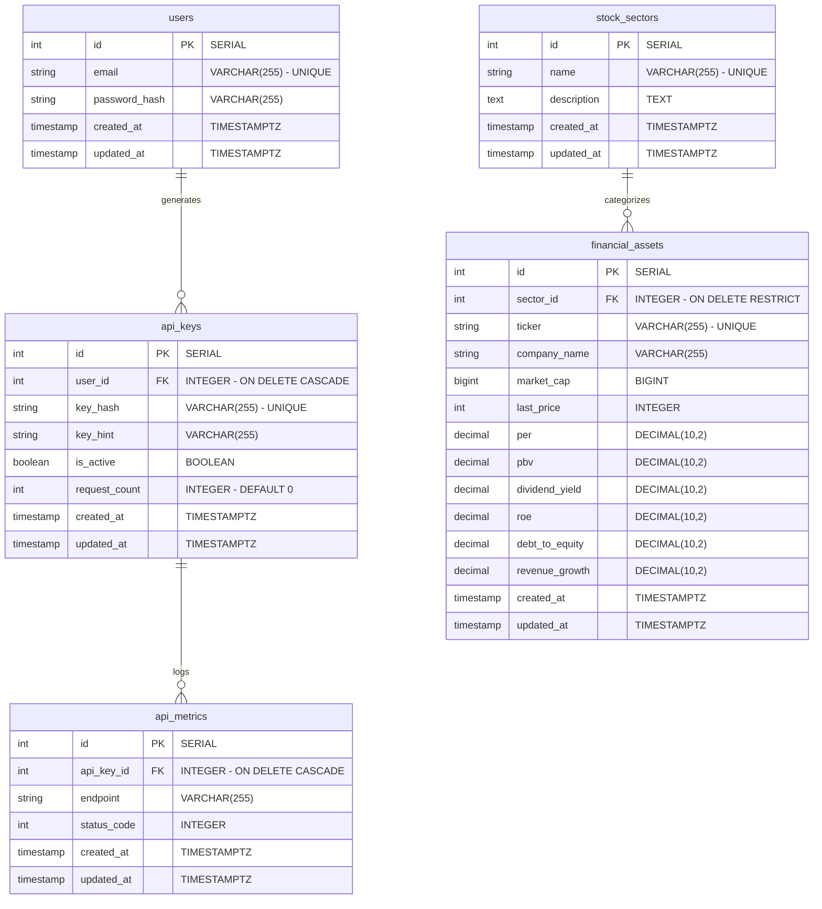
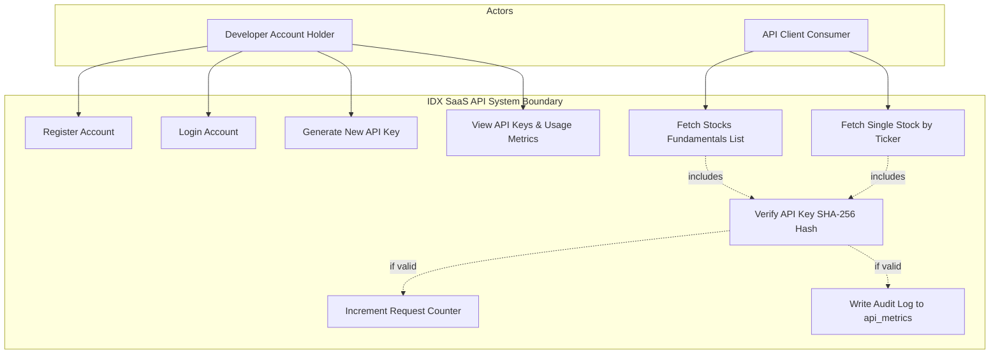

# Project Architecture & Systems Design Report
## IDX Financial & Corporate Fundamentals API-as-a-Service

This systems design report outlines the structural design, data schema models, actor access capabilities, and operational lifecycles for the SaaS project scaffolded in the `UCP2` directory.

---

## 📊 1. Entity Relationship Diagram (ERD)

The data model is structured in a fully normalized relational schema consisting of five tables, optimizing database constraints, indexing, and referential integrity.

### Table Normalization Rationale:
* **`users` & `api_keys`**: One-to-many relationship. Developer registers one profile and can generate multiple API credentials (keys). Deleting the user profile cascades (`ON DELETE CASCADE`) to automatically wipe out linked keys.
* **`api_keys` & `api_metrics`**: One-to-many relationship. Every API request matching a valid key hash is recorded in metrics for auditing and analytics. It cascades deletion.
* **`stock_sectors` & `financial_assets`**: One-to-many relationship. A stock belongs to exactly one sector. We enforce `ON DELETE RESTRICT` on sectors to prevent accidental deletion of a sector category while stocks are still linked to it.
* **`market_cap` Precision**: Market capitalizations are stored as `BIGINT` (64-bit integer) to handle IDX values, which run in trillions of Indonesian Rupiah (e.g. `1220000000000000` IDR for Bank Central Asia).
* **Ratios Precision**: Financial ratios (PER, PBV, ROE, etc.) are stored as `DECIMAL(10, 2)` to avoid floating-point rounding errors during sorting or range filtering.

---

## 👥 2. Use Case Diagram

The use case diagram highlights the system interactions partitioned between the **Developer Account Holder** (managing credentials) and the **API Client Consumer** (querying data in automated pipelines).

---

## 🔄 3. User Flow / Activity Sequence Diagram

This sequence diagram details the full lifecycle of authentication, credential generation, and the exact authorization routing pipeline (including SHA-256 hashing and asynchronous post-response metric logging).

```mermaid
sequenceDiagram
    autonumber
    actor Dev as Developer / API Client
    participant API as Express API Server
    participant DB as Supabase PostgreSQL

    rect rgb(15, 23, 42)
        Note over Dev, DB: 1. Developer Portal Access Flow (JWT)
        Dev->>API: POST /api/auth/register {email, password}
        API->>API: Hash password with bcrypt (10 rounds)
        API->>DB: INSERT INTO users
        DB-->>API: Success (User created)
        API-->>Dev: 201 Created
        
        Dev->>API: POST /api/auth/login {email, password}
        API->>DB: SELECT * FROM users WHERE email = ?
        DB-->>API: User Record (password_hash)
        API->>API: Validate via bcrypt.compare
        API->>API: Sign JWT token {id, email} with JWT_SECRET
        API-->>Dev: 200 OK + JWT Token
    end

    rect rgb(20, 24, 33)
        Note over Dev, DB: 2. API Key Generation Flow
        Dev->>API: POST /api/keys/generate (Auth Header: Bearer JWT)
        API->>API: Verify & decode JWT
        API->>API: Generate cryptographically secure plain key: "idx_live_[48-hex-chars]"
        API->>API: Generate SHA-256 hash of plain key
        API->>API: Generate hint: "idx_live_...[last-6-chars]"
        API->>DB: INSERT INTO api_keys {user_id, key_hash, key_hint, is_active}
        DB-->>API: Confirm insertion
        API-->>Dev: 201 Created + plain key (RETURNED ONLY ONCE)
    end

    rect rgb(28, 20, 28)
        Note over Dev, DB: 3. Public API Consumption Flow (X-API-KEY)
        Dev->>API: GET /api/v1/stocks?sector=Financials&sort_by=per (Header: X-API-KEY)
        API->>API: Extract X-API-KEY from header
        API->>API: Compute SHA-256 hash of extracted key
        API->>DB: SELECT * FROM api_keys WHERE key_hash = ? AND is_active = TRUE
        
        alt API Key Hash Not Found
            DB-->>API: Null
            API-->>Dev: 403 Forbidden / 401 Unauthorized
        else API Key Hash Verified
            DB-->>API: ApiKey Record
            API->>DB: SELECT stocks JOIN sectors WHERE sector_id = ? ORDER BY per ASC
            DB-->>API: Stocks List Data
            API-->>Dev: 200 OK + Stock list JSON response
            
            Note over API: Event: res.on('finish') - Async Pipeline Execution
            API->>DB: UPDATE api_keys SET request_count = request_count + 1 WHERE id = ?
            API->>DB: INSERT INTO api_metrics {api_key_id, endpoint, status_code}
        end
    end
```

---

## 🔒 4. Key Security Controls & Implementations

1. **One-Way API Key Hashing**:
   Storing API keys in plain text leaves them vulnerable to database leaks. We generate a plain token prefixed with `idx_live_`, hash it immediately using **SHA-256**, and store *only* the hash. When a request comes in, we hash the header key and perform an exact match.
2. **Key Hint Identification**:
   Since the raw key cannot be retrieved from the hashed value, we store a visible hint (e.g. `idx_live_...f8a2`) so developers can easily identify which key is which in their dashboard.
3. **Response Interception for Non-Blocking Metrics**:
   Instead of updating counters and writing log metrics before sending data (which increases client response time), we hook into the Express response lifecycle via `res.on('finish', async () => { ... })`. The data is flushed to the client immediately, and the statistics update in the background.
4. **Sequelize Injection Prevention**:
   Query parameters like `sort_by` are checked against a strict whitelist of fields (e.g., `['ticker', 'market_cap', 'per', ...]`). Input orders are forced to be either `ASC` or `DESC`. If a user passes an invalid parameter, it falls back to a default value, neutralizing SQL injection attempts.
